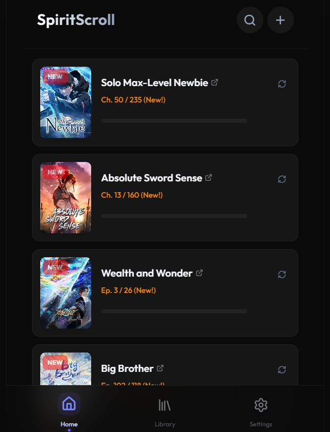

# SpiritScroll

SpiritScroll is a personal Manhua and Donghua progress tracker. It keeps reading and watching progress in one place, checks source URLs for newly released chapters or episodes, and prioritizes entries with available updates on the dashboard.



## Key Features

### Media Tracking

- **Dashboard-first workflow**: View Manhua or Donghua entries from the main dashboard, sorted by update priority or title.
- **Progress controls**: Use quick `+` and `-` actions from each card to update the current chapter or episode.
- **Entry management**: Add, edit, pin, complete, hold, drop, or delete tracked entries.
- **Update badges**: Entries with new releases show a `NEW` badge and the unread gap.
- **Source links**: Open a tracked source directly from the media card.

### Update Checking

- **Scheduled auto scan**: Cloudflare Cron runs the backend scan every 6 hours.
- **Manual scan fallback**: The dashboard Scan button checks all `READING` entries that have a `sourceUrl`.
- **Sequential scraping**: Scans run one entry at a time to stay gentle on source sites.
- **Smart scraping**: The update checker supports Asura Scans, Animexin, and generic WordPress/Manga-style chapter lists.
- **Retry logic**: Network fetches retry before an entry is treated as failed.

### Covers And Settings

- **Auto-cover scraping**: New entries can fetch cover art from their source URL.
- **Refresh Covers tool**: Settings can re-scrape missing covers.
- **Stats**: Settings shows total tracked series and total chapters consumed.
- **Import / Export**: Back up and restore the library as JSON.
- **Authentication**: Production writes are protected by password login and JWT-based API auth.

## Tech Stack

### Frontend (`client/`)

- **Framework**: React + Vite
- **Styling**: Tailwind CSS v4
- **State / Query**: TanStack Query
- **Icons**: Lucide React
- **Runtime / Package manager**: Bun
- **Deployment**: Vercel

### Backend (`server/`)

- **Framework**: Hono
- **Runtime**: Bun locally, Cloudflare Workers in production
- **Database**: Turso/libSQL in production, local libSQL file fallback for development
- **ORM**: Drizzle ORM
- **Scraping**: Cheerio
- **Scheduling**: Cloudflare Cron Trigger (`0 */6 * * *`)

## Getting Started

### Prerequisites

- Bun v1.0+
- A Turso/libSQL database for production-like development, or the local fallback database

### Install Dependencies

```bash
cd server
bun install

cd ../client
bun install
```

### Configure The Backend

Create `server/.dev.vars` for local development:

```env
DATABASE_URL=libsql://your-database.turso.io
DATABASE_AUTH_TOKEN=your_turso_token
JWT_SECRET=replace_with_a_long_random_secret
AUTH_PASSWORD_HASH=replace_with_the_sha256_password_hash
```

If `DATABASE_URL` is omitted locally, the server falls back to `file:spirit_scroll.sqlite`.

Generate a password hash with Bun:

```bash
bun -e "const p='your-password'; const b=await crypto.subtle.digest('SHA-256', new TextEncoder().encode(p)); console.log([...new Uint8Array(b)].map(x=>x.toString(16).padStart(2,'0')).join(''))"
```

Push the schema when setting up a database:

```bash
cd server
bun run db:push
```

### Run Locally

Start the backend:

```bash
cd server
bun run dev
```

The API runs on `http://localhost:3000`.

Start the frontend in another terminal:

```bash
cd client
bun run dev
```

The app runs on `http://localhost:5173`.

## Deployment

The current production shape is:

- **Backend**: Cloudflare Workers
- **Scheduled scans**: Cloudflare Cron, every 6 hours
- **Frontend**: Vercel
- **Database**: Turso/libSQL

Deploy the backend:

```bash
cd server
wrangler deploy
```

Required Cloudflare Worker variables:

- `DATABASE_URL`
- `DATABASE_AUTH_TOKEN`
- `JWT_SECRET`
- `AUTH_PASSWORD_HASH`

For non-interactive deploys, set `CLOUDFLARE_API_TOKEN` in your shell or CI environment.

Deploy the frontend from Vercel with `client/` as the project root and `VITE_API_URL` pointing at the deployed Worker URL.

## Project Structure

- `client/src/components`: Dashboard, cards, dialogs, settings, login, toasts, and layout components.
- `client/src/hooks`: React Query hooks for media CRUD, import/export, and manual update scanning.
- `client/src/lib`: API client configuration.
- `server/src/db`: Drizzle schema and database client setup.
- `server/src/utils`: Cover scraping and update-checking logic.
- `server/src/index.ts`: Hono API routes and Cloudflare scheduled scan handler.
- `server/wrangler.toml`: Cloudflare Worker and Cron Trigger configuration.

## License

MIT
